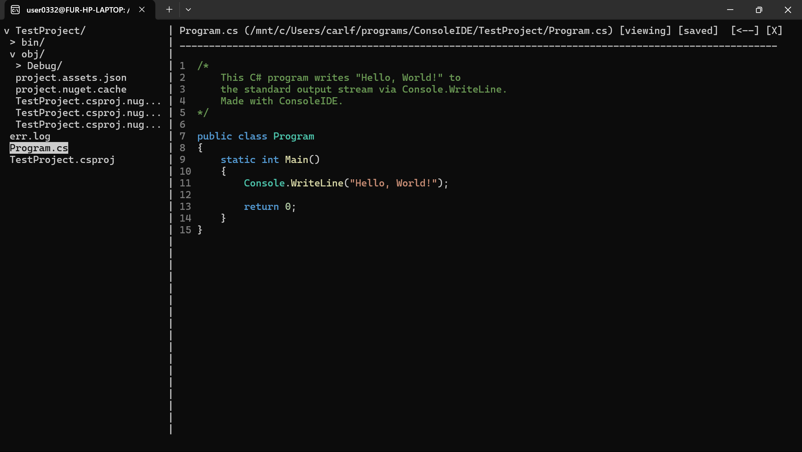

# ConsoleIDE

An IDE written using `ncurses` to run in the console. This project is currently being developed as a C# IDE, but is aimed to be extensible for the future. Currently, Roslyn is being used to provide syntax highlighting for C# files within .NET projects (that have `.csproj` files).

## Screenshots
